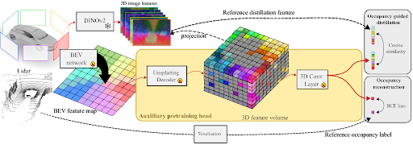

# OccFeat: Self-supervised <u>Occ</u>upancy <u>Feat</u>ure Prediction for Pretraining BEV Segmentation Networks
This is the official repository for our paper: "OccFeat: Self-supervised Occupancy Feature Prediction for Pretraining BEV Segmentation Networks".

[[Paper](https://arxiv.org/abs/2404.14027)] 

## Abstract:

We introduce a self-supervised pretraining method, called OccFeat, for camera-only Bird's-Eye-View (BEV) segmentation networks. With OccFeat, we pretrain a BEV network via occupancy prediction and feature distillation tasks. Occupancy prediction provides a 3D geometric understanding of the scene to the model. However, the geometry learned is class-agnostic. Hence, we add semantic information to the model in the 3D space through distillation from a self-supervised pretrained image foundation model. Models pretrained with our method exhibit improved BEV semantic segmentation performance, particularly in low-data scenarios. Moreover, empirical results affirm the efficacy of integrating feature distillation with 3D occupancy prediction in our pretraining approach.

  

## Coming Soon!

We are in the process of preparing code and models. Stay tuned for updates.